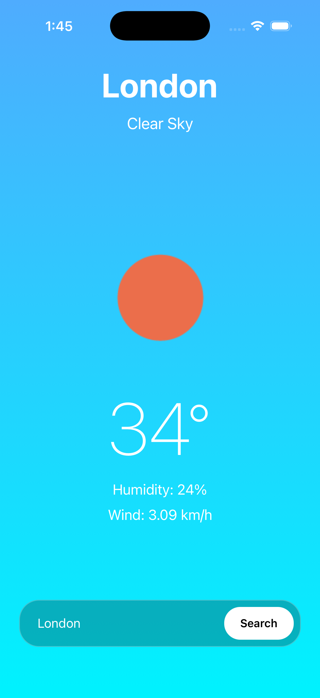
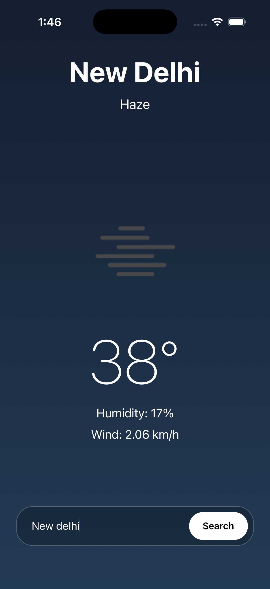
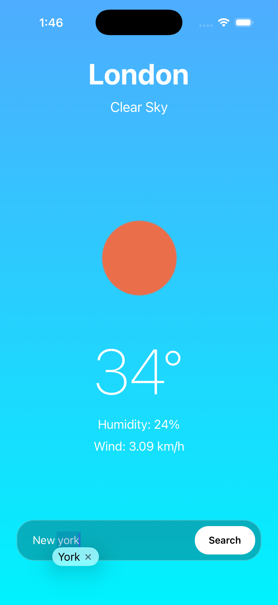

# 🌦 Weather App - React Native

A modern and responsive Weather App built using React Native and TypeScript with real-time weather updates powered by OpenWeather API.

---

# ✨ Features

- 🌍 Search weather by city
- 🌤 Real-time weather updates
- 🌙 Dynamic day/night gradients
- 📱 Responsive mobile UI
- 🌡 Temperature display
- 💨 Wind speed information
- 💧 Humidity information
- 🔍 Floating bottom search bar
- ⚡ Loading state handling
- ❌ Error handling for invalid cities
- 🎨 Custom app icon integration

---

# 📸 Screenshots

## ☀️ Day Mode



---

## 🌙 Night Mode



---

## 🔍 City Search



---

# 🚀 Tech Stack

- React Native
- TypeScript
- OpenWeather API
- react-native-linear-gradient
- react-native-safe-area-context

---

# 📦 Installation

## 1️⃣ Clone Repository

```bash
git clone https://github.com/nirosha-reactnativedev/modern-weather-app.git
```

---

## 2️⃣ Navigate To Project

```bash
cd modern-weather-app
```

---

## 3️⃣ Install Dependencies

```bash
npm install
```

---

## 4️⃣ Install iOS Pods

```bash
cd ios
pod install
cd ..
```

---

# 🔑 OpenWeather API Setup

This app uses the OpenWeather API to fetch real-time weather data.

---

## Step 1 — Create OpenWeather Account

Visit:

https://openweathermap.org/

Create a free account.

---

## Step 2 — Generate API Key

After login:

- Go to your profile
- Open "My API Keys"
- Generate a new API key

OR directly visit:

https://home.openweathermap.org/api_keys

---

## Step 3 — Copy Your API Key

Example:

```txt
abc123xyz456
```

---

## Step 4 — Add API Key To Project

Open:

```txt
src/services/weatherApi.ts
```

Replace:

```ts
const API_KEY = 'YOUR_API_KEY';
```

with:

```ts
const API_KEY = 'YOUR_REAL_API_KEY';
```

---

# ▶ Running The App

## Start Metro Server

```bash
npm start
```

---

## Run iOS App

```bash
npx react-native run-ios
```

---

# 📁 Folder Structure

```txt
src/
  components/
  screens/
  services/
  types/

screenshots/
```

---

# 🎨 UI Features

- Dynamic weather-based gradients
- Day/Night responsive background
- Minimal modern design
- Floating glassmorphism search bar
- Responsive mobile layout

---

# 📚 Concepts Learned

- React Native fundamentals
- TypeScript integration
- API integration using fetch()
- Async/Await
- State management with Hooks
- Error handling
- Responsive mobile UI
- Safe area handling
- Native app assets
- Dynamic UI rendering

---

# 👨‍💻 Author

Nirosha Chimmula

---

# ⭐ Support

If you like this project, consider giving it a star on GitHub ⭐